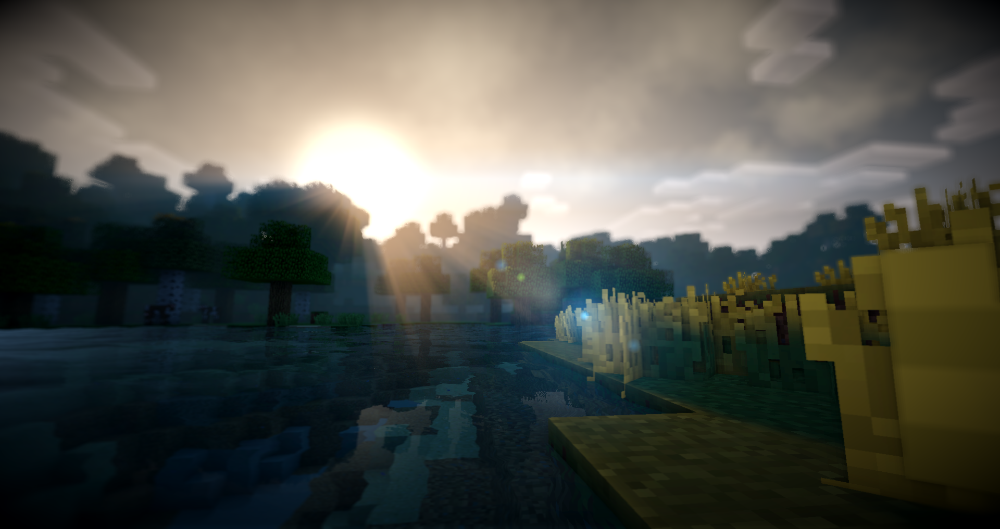
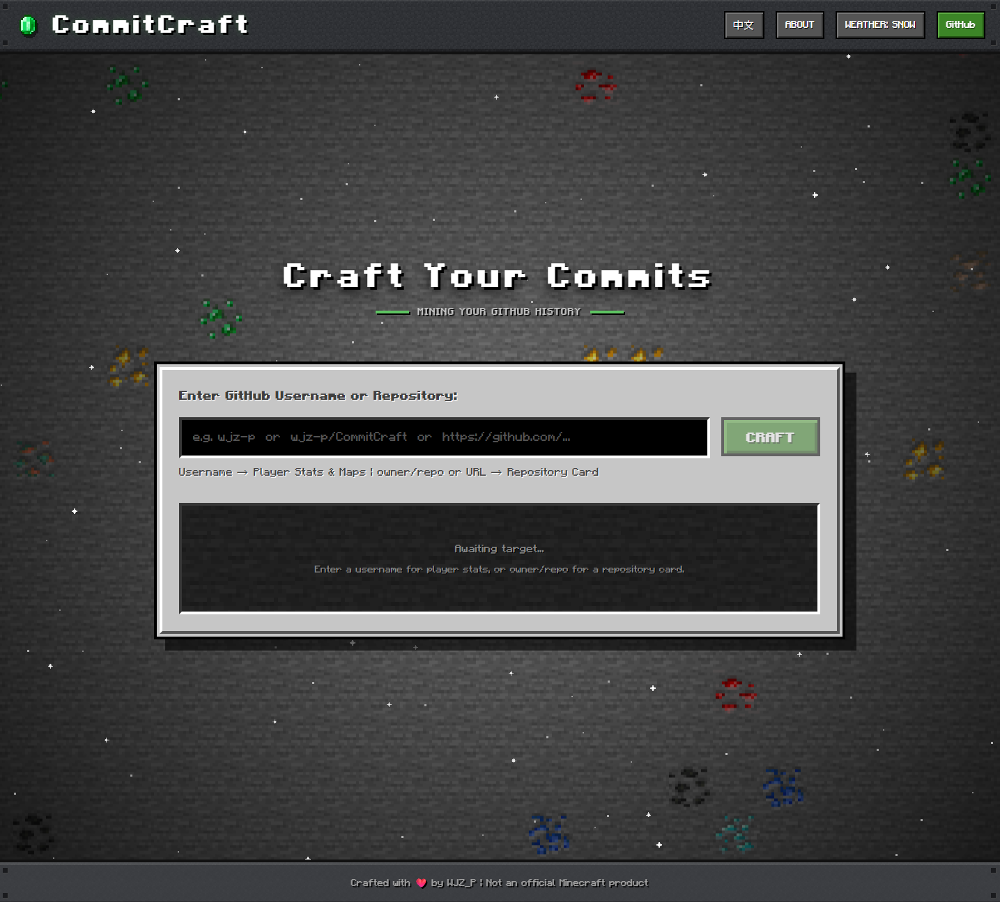

# Forge your GitHub stats into Minecraft-style pixel SVGs.

<div align="center">

  <a href="https://github.com/WJZ-P/CommitCraft/graphs/contributors">
    
  </a>
  &nbsp;
  <a href="https://github.com/WJZ-P/CommitCraft/network/members">
    
  </a>
  &nbsp;
  <a href="https://github.com/WJZ-P/CommitCraft/stargazers">
    
  </a>
  &nbsp;
  <a href="https://github.com/WJZ-P/CommitCraft/issues">
    
  </a>

</div>

<br>

<p align="center">
  
</p>

<h1 align="center">Commit Craft</h1>

<p align="center">
  <a href="./README.md">中文</a>
  ·
  <a href="./README.en.md">English</a>
</p>

<p align="center">
  <a href="https://commit-craft.wjz-p.workers.dev/">Live Demo</a>
  ·
  <a href="https://github.com/WJZ-P/CommitCraft/issues">Report Bug</a>
  ·
  <a href="https://github.com/WJZ-P/CommitCraft/issues">Request Feature</a>
</p>

<br>

<p align="center">
  <a href="https://www.minecraft.net/en-us/store/minecraft-deluxe-collection-pc">
    
  </a>
</p>
<p align="center" style="font-size: 14px; font-style: italic; color: #888;">"Sometimes the player dreamed that it was a miner, on the surface of a world that was flat, and infinite. The sun was a square of white."</p>
<h3 align="center">"You are the player."</h3>
<h1 align="center">"Wake up."</h1>
<p align="right"><sub>—— "End Poem", Minecraft</sub></p>

## 🖥️ Homepage (click to visit)

<p align="center">
  <a href="https://commit-craft.wjz-p.workers.dev/">
    
  </a>
</p>

## ✨ Features

| Module | Description |
|:---:|:---|
| 🗺️ **Contribution Map** | Transforms your annual contribution heatmap into a Minecraft-style isometric terrain map — block height and ore types scale with commit count |
| 🏳️ **Banner Hall** | Generates achievement banners from your GitHub stats, with drag-to-rotate 3D perspective |
| 🪪 **Player Passport** | Creates a player passport card with customizable signature quote |
| 📦 **Repo Card** | Displays repo name, description, language & popularity — supports CJK mixed-text export |

All outputs are in **SVG format** — infinitely scalable, easy to embed in web pages and READMEs.

### 🗺️ Contribution Map

<p align="center">
  <a href="https://commit-craft.wjz-p.workers.dev/">
    
  </a>
</p>

### 🪪 Player Passport

<p align="center">
  <a href="https://commit-craft.wjz-p.workers.dev/">
    
  </a>
</p>

### 🏳️ Banner Hall

<p align="center">
  
  
  
  
</p>

### 📦 Repo Card

<p align="center">
  <a href="https://github.com/WJZ-P/CommitCraft">
    
  </a>
</p>

## 📖 Background

This project was originally built with **Next.js** and planned for deployment on Vercel. Later, considering that **Cloudflare Workers** offers a much more generous free tier (100k requests/day for free), the project was migrated to [vinext](https://github.com/cloudflare/vinext) (Vite + Next.js on Cloudflare) — keeping the Next.js developer experience while enjoying Cloudflare's free hosting.

## 🚀 Quick Start

Visit the [live site](https://commit-craft.wjz-p.workers.dev/) and enter:

- **GitHub username** (e.g. `wjz-p`) → generates Contribution Map, Banner Hall & Player Passport
- **Repo shorthand** (e.g. `vercel/next.js`) → generates Repo Card
- **Full repo URL** (e.g. `https://github.com/vercel/next.js`) → auto-parses and generates Repo Card

Click **CRAFT** to generate. Each view supports **downloading as .SVG** and provides a copyable API endpoint for embedding.

## 📡 API / Embedding

Generated SVGs can be embedded in READMEs or web pages via the following API endpoints:

```
# Contribution Map
https://commit-craft.wjz-p.workers.dev/api/map/{username}.svg

# Contribution Map (with animation)
https://commit-craft.wjz-p.workers.dev/api/map/{username}.svg?animate=true

# Player Passport (with custom quote)
https://commit-craft.wjz-p.workers.dev/api/card/{username}.svg?quote=Your+Quote+Here

# Banner Hall (with rotation angle)
https://commit-craft.wjz-p.workers.dev/api/banner/{username}/{statId}.svg?rotation=30

# Repo Card
https://commit-craft.wjz-p.workers.dev/api/repo/{owner}/{repo}.svg
```

Embed in Markdown:

```markdown


```

## 🛠️ Tech Stack

- **Framework**: [Next.js](https://nextjs.org/) (App Router) + [React 19](https://react.dev/)
- **Build & Deploy**: [vinext](https://github.com/cloudflare/vinext) + [Cloudflare Workers](https://workers.cloudflare.com/)
- **Styling**: [Tailwind CSS 4](https://tailwindcss.com/)
- **i18n**: [next-intl](https://next-intl.dev/) (Chinese / English)
- **Pixel Fonts**: Minecraft Font + [Zpix](https://github.com/SolidZORO/zpix-pixel-font) (Chinese pixel font)
- **SVG Generation**: Server-side SVG templates + [opentype.js](https://opentype.js.org/) font baking

## 📦 Local Development

```bash
# Clone the repo
git clone https://github.com/WJZ-P/CommitCraft.git
cd CommitCraft

# Install dependencies
npm install

# Set up environment variables (requires a GitHub Token)
echo "GITHUB_TOKEN=your_github_token_here" > .env.local

# Start the dev server
npm run dev
```

> 💡 You'll need a [GitHub Personal Access Token](https://github.com/settings/tokens) (only `public_repo` scope required) to fetch contribution data.

## ☁️ Deployment

Built on vinext with native Cloudflare Workers support:

```bash
# Build
npm run build

# Deploy to Cloudflare Workers
npm run deploy
```

Before deploying, set the `GITHUB_TOKEN` secret in your Cloudflare Dashboard.

## 🌐 Internationalization

Supports Chinese and English. Toggle via the button in the top-right corner of the page. Language preference is saved in a cookie.

## 📝 License

Made with ❤️ by [WJZ_P](https://github.com/WJZ-P) | NOT AN OFFICIAL MINECRAFT PRODUCT.

## ©️ Copyright

This project is licensed under [CC BY-NC 4.0](https://creativecommons.org/licenses/by-nc/4.0/). See [LICENSE](LICENSE) for details.

## ⭐ Star History

**If you like this project, please give it a ⭐!**

[](https://starchart.cc/WJZ-P/CommitCraft)

---
